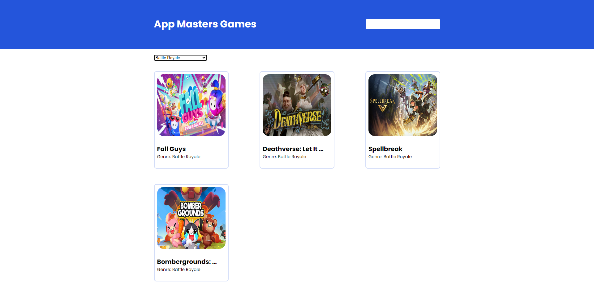

# **App Masters Games**
## Descrição
O App Masters Games é uma aplicação web interativa que oferece aos usuários a capacidade de explorar e descobrir uma ampla variedade de jogos. Com esta aplicação, os usuários podem listar, buscar por nome e filtrar por gênero os jogos disponíveis.

## Funcionalidades

1. Listar jogos: Os usuários podem visualizar uma lista de jogos disponíveis.
2. Buscar por nome: Os usuários podem pesquisar por jogos utilizando o nome do jogo.
3. Buscar por gênero: Os usuários podem filtrar os jogos por gênero, exibindo apenas os jogos relacionados a um determinado gênero.

## Tecnologias Utilizadas
* React
* TypeScript
* React Query
* Axios
* Sass
* React Hook Form

## Pré-requisitos
Antes de iniciar o projeto, é necessário ter instalado em sua máquina o Node.js e o Yarn.

* Node.js (versão 12 ou superior)
* Yarn (versão 1.22 ou superior)

## Instalação
1. Clone este repositório para o seu ambiente local.
2. Abra o terminal e navegue até o diretório raiz do projeto.
3. Execute o comando yarn para instalar todas as dependências.
4. Execute o comando yarn dev para iniciar a aplicação.
5. A aplicação estará disponível em `http://localhost:5173/`

## Contribuição
Se desejar contribuir para este projeto, fique à vontade para fazer um fork e enviar um pull request. Será um prazer revisar suas contribuições.
