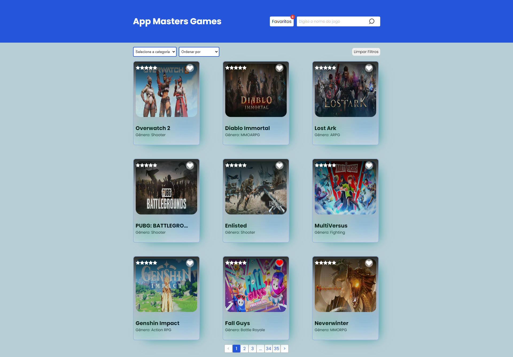

# **App Masters Games**
## Descrição
O App Masters Games é uma aplicação web interativa que oferece aos usuários a capacidade de explorar e descobrir uma ampla variedade de jogos. Com esta aplicação, os usuários podem listar, buscar por nome e filtrar por gênero os jogos disponíveis.

## Funcionalidades

1. Listar jogos: Os usuários podem visualizar uma lista de jogos disponíveis.
2. Buscar por nome: Os usuários podem pesquisar por jogos utilizando o nome do jogo.
3. Buscar por gênero: Os usuários podem filtrar os jogos por gênero, exibindo apenas os jogos relacionados a um determinado gênero.

## Requisistos funcionais cumpridos 12/12
 * O projeto deve ser feito usando React ou Next.JS ✅

 * Obter a lista de jogos em /data ✅
 * Apresentar um loader enquanto os dados são obtidos ✅
 * Apresentar os jogos em três colunas (no computador) ✅
 * Em cada card apresentar o título e imagem pelo ao menos
 Lidar com a responsividade, para que fique bem apresentado no computador, tablets ou celular ✅
 * Quando a API retornar o status code 500, 502, 503, 504, 507, 508 ou 509 apresentar ao usuário "O servidor fahou em responder, tente recarregar a página" ✅
 * Caso a API retorne outros erros, apresentar "O servidor não conseguirá responder por agora, tente voltar novamente mais tarde" ✅
 * Ao realizar uma chamada, não esperar mais que 5 segundos pelo retorno. Se os dados demorarem mais de 5 segundos para retornar apresentar "O servidor demorou para responder, tente mais tarde" ✅
 * Sempre que apresentar uma mensagem para o usuário, ou tiver os dados em mãos para apresentar, ocultar o loader ✅
 * Incluir um campo de busca, que permite localizar jogos pelo título, com busca case insensitive ✅
 * Uma vez que tenha os dados em mãos, veja quais genre foram retornados e permita ao usuário selecionar um deles, e então filtre para exibir apenas jogos do gênero selecionado ✅

## Tecnologias Utilizadas
* React
* TypeScript
* React Query
* Axios
* Sass
* React Hook Form

## Pré-requisitos
Antes de iniciar o projeto, é necessário ter instalado em sua máquina o Node.js e o Yarn.

* Node.js (versão 12 ou superior)
* Yarn (versão 1.22 ou superior)

## Instalação
1. Clone este repositório para o seu ambiente local.
2. Abra o terminal e navegue até o diretório raiz do projeto.
3. Execute o comando yarn para instalar todas as dependências.
4. Execute o comando yarn dev para iniciar a aplicação.
5. A aplicação estará disponível em `http://localhost:5173/`

## Contribuição
Se desejar contribuir para este projeto, fique à vontade para fazer um fork e enviar um pull request. Será um prazer revisar suas contribuições.
